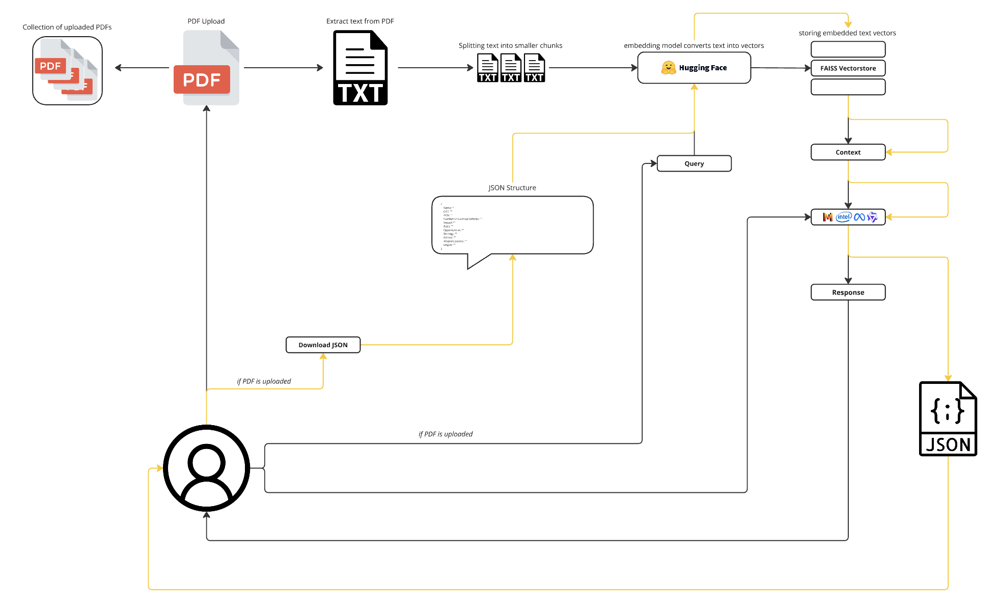

---

# YOLOPDF - A PDF Chatbot

YOLOPDF is a project developed by Jonathan, Walid, and Mika for the "Simulation of AI Agents" class. This project demonstrates how AI can interact with PDF documents, extract relevant information, and facilitate user interaction through a chatbot interface.

---

## Table of Contents

1. [Architecture Overview](#architecture-overview)
   - [Components](#components)
   - [Language Models Used](#language-models-used)
   - [Architecture Screenshot](#architecture-screenshot)
2. [Deployment Guide](#deployment-guide)
3. [Usage Instructions](#usage-instructions)
   - [Uploading and Processing PDFs](#uploading-and-processing-pdfs)
   - [Downloading JSON](#downloading-json)
   - [Demo Video](#demo-video)
4. [Project Review](#project-review)
   - [Features](#features)
   - [Development Process](#development-process)
5. [Course Improvement Suggestions](#course-improvement-suggestions)
6. [Additional Notes](#additional-notes)

---

## Architecture Overview

### Components

1. **Frontend (Gradio Interface)**
   - **PDF Viewer:** Displays the uploaded PDF within an HTML-iFrame.
   - **Chatbot Interface:** Provides a chat interface for user interaction with the PDF content.
   - **Model Selection:** Allows the selection of different language models (LLMs).
   - **File Upload and JSON Download:** Facilitates uploading PDFs and downloading extracted information in JSON format.

2. **Backend**
   - **PDF Processing:** Extracts text from uploaded PDFs and splits it into chunks.
   - **LLM Integration:** Utilizes `ChatOpenAI` and `HuggingFaceEmbeddings` for processing and generating responses.
   - **Vector Store:** Uses FAISS to store and retrieve text embeddings.
   - **Chat History:** Saves and loads chat history in JSON files.

### Language Models Used

1. **mixtral-8x7b-instruct**
2. **meta-llama-3-70b-instruct**
3. **qwen1.5-72b-chat**

These models are initialized with the `ChatOpenAI` class from the `langchain_openai` library and are optimized for tasks such as text extraction and question answering.

### Architecture Screenshot



---

## Deployment Guide

1. **Prerequisites**
   - Install the required libraries using:
   ```bash
   pip install -r requirements.txt
   ```

2. **Clone the repository**
   ```bash
   git clone https://github.com/Simulation-of-AI-agents/Chat-to-PDF.git
   cd Chat-to-PDF
   ```

3. **Configure API Key**
   - Create a configuration file `Chatbot/key.secret`.
   - Add the following content with your API key:
     ```ini
     [GWDG]
     API_KEY=your_openai_api_key
     ```

4. **Start the application**
   ```bash
   python gradio-app.py
   ```

The Gradio interface will start locally and can be accessed through a web browser on port:

```bash
http://127.0.0.1:7860/
```

***Browser Recommendation:*** *Use Firefox or Safari, as larger PDFs may not display correctly in Chrome.*

---

## Usage Instructions

### Uploading and Processing PDFs

1. **Upload PDF**
   - Click the "Click to Upload a File" button.
   - Select a PDF from your local filesystem.

2. **View and Interact with PDF**
   - The uploaded PDF will be displayed in the PDF viewer.
   - Use the dropdown menu to switch between multiple uploaded PDFs.

3. **Chatbot Interaction**
   - Enter your questions or commands in the message field and press Enter.
   - The chatbot will respond based on the PDF content and the previous chat history.

### Downloading JSON

- After processing a PDF, click the "Download JSON" button to download the extracted information in JSON format.
- The generated JSON files for the Sustainability Reports are located in the `extract` folder.

### Demo Video


---

## Project Review

### Features

- **PDF Text Extraction:** Efficiently processes and extracts text from PDFs, including handling encrypted files.
- **Interactive Chatbot:** Enables natural language interaction with PDF contents through advanced language models.
- **JSON Export:** Provides a convenient way to download extracted information.
- **PDF Dropdown Menu:** Allows users to switch between multiple uploaded PDFs easily via a dropdown menu.
- **LLM Dropdown Menu:** Provides an interface to select different language models for processing, enhancing flexibility and performance.

### Development Process

The project evolved through several phases:

**1. Initial Setup:** Initially, we set up basic integration with Flask and Gradio to develop the PDF processing pipeline. Originally, we planned to integrate Gradio into our Flask server but encountered difficulties in transferring data between Flask and Gradio. Therefore, we opted to exclusively use Gradio for our application.

**2. LLM Integration:** We experimented with several Language Models (LLMs) to find the optimal solution for text extraction and response generation. We evaluated the following models:
- intel-neural-chat-7b (Excluded due to poor performance)
- mixtral-8x7b-instruct
- qwen1.5-72b-chat
- meta-llama-3-70b-instruct (prefered)

**3. UI/UX Enhancements:** To enhance user experience, we expanded the user interface features. This included functionalities such as file upload for PDFs, dropdown menus for selecting LLMs, and the ability to export sustainability values as JSON. These enhancements were directly implemented within the Gradio application. We opted for a dark ChatGPT-like design with the Githubs monospace font.

**4. Chunk Size Optimization:** A critical step involved fine-tuning chunk sizes and embedding strategies to maximize performance and accuracy. Based on our experiments with the Airbus Sustainability Report, we determined the optimal chunk sizes for each LLM, which were implemented in the gradio-app.py. We tested the time required for file upload, JSON download and model response per LLM.

**5. JSON Prompt Optimization:** During the optimization of JSON prompts, we made iterative improvements. By gradually refining the prompts, we aimed to ensure that the extracted data from PDFs were accurately and reliably transformed into the JSON format.

---

## Course Improvement Suggestions

**1. Unlimited Access to LLM and Embedding API:** Having unlimited access to Language Models (LLMs) and Embedding APIs would really speed up our development process and make our final product even better.

**2. Milestones:** The milestones we set and our milestone meetings were super helpful in keeping us on track. You should definitely keep doing this. It keeps everyone focused and ensures that the students making steady progress.

**3. Guided Instructional Course:** The course guided by Ricardo and Debayan was very helpful and we learned a lot about RAG and LLM implementation. It made sure everyone had the know-how to build our chatbot successfully.

---

If you encounter issues or have questions, feel free to contact us via the issue tracker on the repository.
